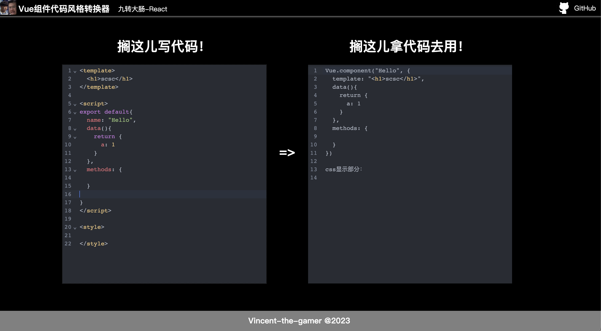

# Change-Vue-Style
自动把Vue组件的单文件格式转换成Vue.component写法，纯整活的，别在意233

## 直接访问该网站
访问：[https://vincent-the-gamer.github.io/Change-Vue-Style](https://vincent-the-gamer.github.io/Change-Vue-Style)

图片预览：

## 自己跑代码
拉取项目
~~~shell
git clone https://github.com/Vincent-the-gamer/Change-Vue-Style.git
~~~

安装依赖
~~~shell
npm install
yarn install
~~~

启动项目
~~~shell
npm run serve
yarn run serve
~~~